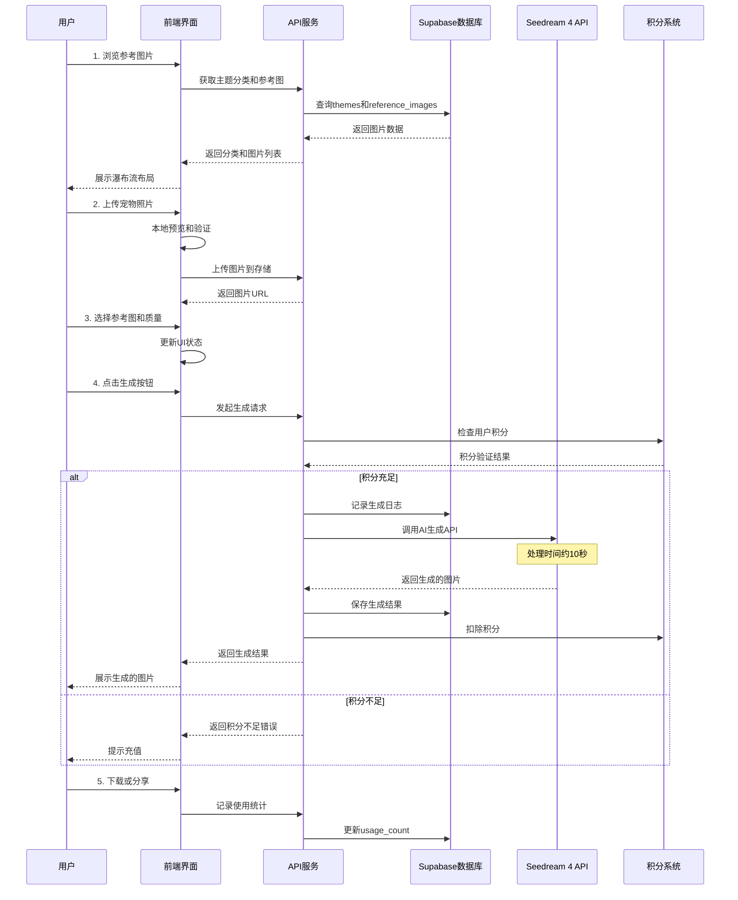
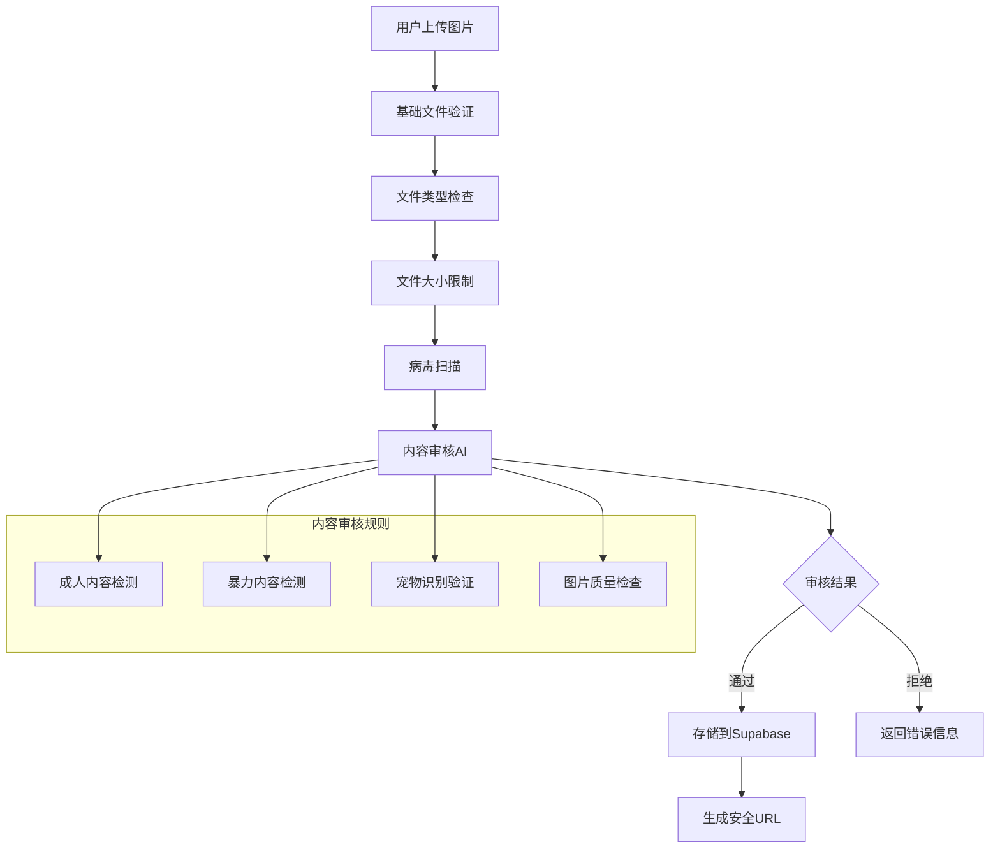
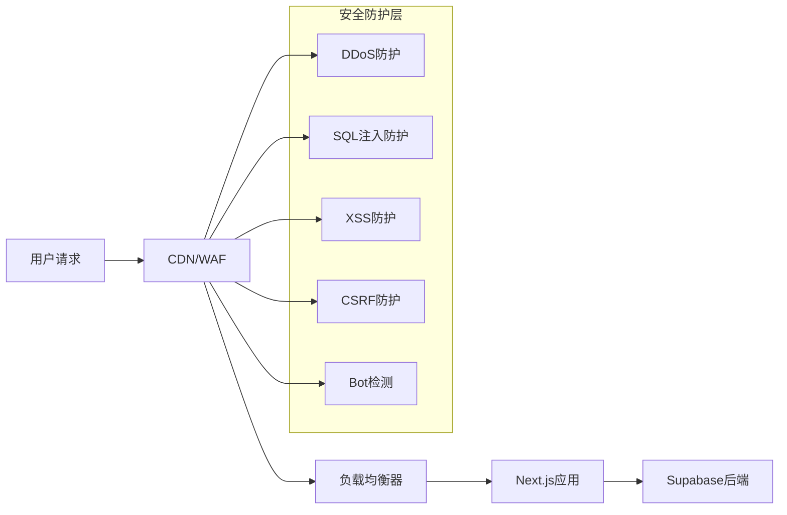

# AI-Petography.com 产品需求文档 (PRD)

## 📋 产品概述

### 核心目标 (Mission)
打造全球领先的AI宠物照片生成平台，让每个宠物主人都能轻松创造出专业级的宠物艺术作品，并通过社区分享传播快乐。

### 用户画像 (Persona)
**主要用户**：宠物主人（25-45岁），热爱分享宠物生活，追求个性化和创意表达
**核心痛点**：
- 想为宠物拍出专业照片但缺乏技能和设备
- 希望创造独特的宠物形象但成本高昂
- 渴望在社交媒体上分享有趣的宠物内容

## 🚀 产品路线图

### V1: 最小可行产品 (MVP)
- ✅ **用户认证系统**（复用现有Supabase认证）
- ✅ **积分付费系统**（复用现有Creem支付）
- ✅ **主题分类浏览**（5个核心主题：节日、职业、奇幻、时尚、艺术）
- ✅ **参考图片展示**（基于使用次数排序的瀑布流布局）
- ✅ **宠物照片上传**（悬浮上传框，支持拖拽）
- ✅ **AI图片生成**（Seedream 4集成，支持普通/2K/4K质量）
- ✅ **生成结果管理**（右侧栏展示，支持下载和重新生成）
- ✅ **基础分享功能**（一键分享到主流社交平台）
- ✅ **用户个人主页**（历史作品展示）

### V2 及以后版本 (Future Releases)
- **用户生成画廊**（独立tab展示所有用户作品）
- 🔄 **多参考图批量生成**
- **内容审核**：用户生成的图片需通过基础AI审核才能发布到公共画廊
- 💬 **社交互动功能**（点赞、评论、收藏）
- 🎨 **创作者模式**（用户上传模板和提示词）
- 🌐 **多语言支持**
- 📱 **移动端APP**

## 📊 关键业务逻辑

### 积分消费规则
- 普通质量：100积分
- 2K质量：300积分
- 4K质量：500积分

### 主题管理
- 管理员可动态添加新主题，每个主题包含多个参考图片
- 主题支持排序和启用/禁用状态

### 使用次数统计
- 每次用户选择参考图生成时，该图片使用次数+1
- 基于使用次数进行热门排序

### 生成限制
- 单次上传最多3张宠物照片
- 单次生成最多选择1个参考图（MVP阶段）

## 🗄️ 数据契约

### 核心数据表结构
```sql
-- 主题分类表
themes (
    id uuid primary key,
    name text not null,
    description text,
    sort_order integer default 0,
    is_active boolean default true,
    created_at timestamp with time zone default now()
);

-- 参考图片模板表
reference_images (
    id uuid primary key,
    theme_id uuid references themes(id),
    image_url text not null,
    prompt_text text not null,
    usage_count integer default 0,
    is_featured boolean default false,
    created_at timestamp with time zone default now()
);

-- 宠物图片生成记录表（增加任务与错误观测字段）
pet_generations (
    id uuid primary key,
    task_id text unique,                          -- 生成任务ID
    idempotency_key text,                         -- 幂等键，防重复扣费/下单
    user_id uuid references auth.users(id),
    reference_image_id uuid references reference_images(id) on delete set null,
    pet_image_urls text[] not null,
    generated_image_url text,
    quality_level text check (quality_level in ('normal', '2k', '4k')),
    credits_used integer not null,
    generation_status text check (
      generation_status in ('pending','running','succeeded','failed','cancelled')
    ) default 'pending',
    error_code text,
    error_message text,
    started_at timestamp with time zone,
    completed_at timestamp with time zone,
    is_public boolean default false,
    metadata jsonb default '{}',
    created_at timestamp with time zone default now()
);

-- 查询与排序常用索引（建议）
-- reference_images 高频筛选与热门排序
-- CREATE INDEX idx_reference_images_theme_usage ON reference_images(theme_id, usage_count DESC, created_at DESC);
-- pet_generations 用户维度查询与状态筛选
-- CREATE INDEX idx_pet_generations_user_created ON pet_generations(user_id, created_at DESC);
-- CREATE INDEX idx_pet_generations_status ON pet_generations(generation_status);
```

## 🎨 UI/UX 设计方案

### 选定方案：经典瀑布流布局
- **主区域**：瀑布流展示参考图片，支持主题筛选
- **右侧栏**：当前生成结果大图展示 + 历史生成小图滑动浏览
- **底部悬浮**：智能上传区域，支持拖拽上传和质量选择

### 关键交互设计
1. **图片选择**：点击参考图片高亮选中，显示使用次数
2. **上传预览**：支持拖拽上传，实时预览宠物照片
3. **生成进度**：10秒生成过程显示进度条和预计时间
4. **结果展示**：大图展示当前结果，小图滑动浏览历史
5. **一键操作**：下载、重新生成、分享等快捷操作

## 🏗️ 技术架构

### 核心流程图



### 组件交互架构图

```mermaid
flowchart TD
    A[用户界面层] --> B[业务逻辑层]
    B --> C[数据访问层]
    C --> D[外部服务层]

    subgraph "前端组件 (复用现有架构)"
        A1[主页瀑布流组件]
        A2[图片上传组件]
        A3[生成结果组件]
        A4[个人主页组件]
        A5[主题分类组件]
    end

    subgraph "API路由 (新增)"
        B1[/api/pet-images/generate]
        B2[/api/themes]
        B3[/api/reference-images]
        B4[/api/user-generations]
        B5[/api/upload]
    end

    subgraph "数据库表 (新增)"
        C1[themes]
        C2[reference_images]
        C3[pet_generations]
        C4[user_uploads]
    end

    subgraph "现有系统 (复用)"
        C5[customers - 积分系统]
        C6[auth.users - 用户认证]
    end

    subgraph "外部服务"
        D1[Seedream 4 API]
        D2[Supabase Storage]
        D3[Creem 支付系统]
    end

    A1 --> B2
    A1 --> B3
    A2 --> B5
    A3 --> B1
    A4 --> B4

    B1 --> C3
    B1 --> D1
    B2 --> C1
    B3 --> C2
    B4 --> C3
    B5 --> D2

    B1 --> C5
    B4 --> C6
```

### 组件交互说明

#### 新增模块与现有模块的关系

1. **复用现有认证系统**
   - 直接使用 `auth.users` 表和现有的认证中间件
   - 复用 `Header` 组件的用户状态管理

2. **复用现有积分系统**
   - 使用现有的 `customers` 表和积分字段
   - 复用 `use-credits.ts` 和 `use-subscription.ts` hooks
   - 集成现有的 Creem 支付流程

3. **新增核心功能模块**
   - `components/pet-generator/` - 宠物照片生成相关组件
   - `app/pet-generator/` - 新的页面路由
   - `app/api/pet-images/` - 新的API路由

#### 文件结构扩展
```
app/
├── pet-generator/           # 新增：宠物照片生成主页
│   ├── page.tsx
│   └── layout.tsx
├── profile/                 # 扩展：用户个人主页
│   ├── page.tsx            # 修改：添加宠物作品展示
│   └── pet-gallery/        # 新增：个人宠物作品页
├── api/
│   ├── pet-images/         # 新增：宠物图片相关API
│   │   ├── generate/
│   │   ├── upload/
│   │   └── user-gallery/
│   └── themes/             # 新增：主题管理API

components/
├── pet-generator/          # 新增：宠物生成器组件
│   ├── theme-gallery.tsx   # 主题瀑布流
│   ├── upload-zone.tsx     # 上传区域
│   ├── result-panel.tsx    # 结果展示面板
│   └── quality-selector.tsx
└── profile/
    └── pet-works.tsx       # 新增：个人作品展示组件
```

### 技术选型与风险评估

#### 关键技术选型

1. **图片处理**
   - **选择**: 使用 Next.js Image 组件 + Supabase Storage
   - **理由**: 与现有架构一致，支持自动优化和CDN加速

2. **AI图片生成**
   - **选择**: Seedream 4 API
   - **集成方式**: 类似现有的 OpenAI API 调用模式

3. **状态管理**
   - **选择**: React useState + useContext (与现有项目一致)
   - **理由**: 保持技术栈统一，降低复杂度

4. **图片上传**
   - **选择**: 直接上传到 Supabase Storage
   - **优化**: 客户端压缩 + 进度显示

#### 潜在技术风险

1. **AI生成延迟风险**
   - **风险**: 10秒生成时间可能导致用户流失
   - **缓解**: 实现WebSocket实时进度推送，添加有趣的等待动画

2. **图片存储成本**
   - **风险**: 大量高质量图片存储成本高
   - **缓解**: 实现图片压缩策略，设置存储期限

3. **并发生成限制**
   - **风险**: Seedream 4 API可能有并发限制
   - **缓解**: 实现队列系统，显示排队状态

4. **积分系统兼容性**
   - **风险**: 新的积分消费规则可能与现有系统冲突
   - **缓解**: 扩展现有积分系统，保持向后兼容

### 技术栈选择
- **前端**：Next.js 14 + React 19 + TypeScript
- **后端**：Next.js API Routes
- **数据库**：Supabase PostgreSQL
- **认证**：Supabase Auth
- **支付**：Creem.io
- **AI服务**：Seedream 4 API
- **存储**：Supabase Storage
- **样式**：Tailwind CSS + shadcn/ui

### 核心API设计
```typescript
// 生成宠物照片（幂等）
// Header: Idempotency-Key: <uuid>
POST /api/pet-images/generate
{
  referenceImageId: string,
  petImageUrls: string[],
  qualityLevel: 'normal' | '2k' | '4k'
}
// Response: { taskId: string }

// 查询生成任务状态
GET /api/pet-images/status?taskId=xxx
// Response: { status: 'pending'|'running'|'succeeded'|'failed'|'cancelled',
//             generatedImageUrl?: string, errorCode?: string, errorMessage?: string }

// 获取主题列表
GET /api/themes

// 获取参考图片
GET /api/reference-images?themeId=xxx&page=1&limit=20

// 用户生成历史
GET /api/user-generations?userId=xxx&page=1&limit=10
```

## 🎯 成功指标

### MVP阶段关键指标
- **用户注册转化率** > 15%
- **首次生成完成率** > 80%
- **用户留存率**（7天）> 25%
- **平均每用户生成次数** > 3次
- **积分购买转化率** > 10%

### 产品增长指标
- **月活跃用户数** (MAU)
- **用户生成内容数量** (UGC)
- **社交分享次数**
- **平均会话时长**

## 📅 详细开发计划与行动方案

### 🎯 MVP开发总体规划

**总体目标**: 在8-10周内完成AI宠物照片生成平台MVP，实现从用户注册到图片生成的完整闭环。

**核心成功指标**:
- 用户注册转化率 > 15%
- 首次生成完成率 > 80%
- 用户留存率（7天）> 25%
- 平均每用户生成次数 > 3次

---

### 📋 Phase 1: 框架清理与数据库设置 (1-2周)

**目标**: 清理现有中文名字生成器代码，建立宠物照片生成的数据基础

#### ✅ 已完成任务
- [x] **移除业务逻辑代码**
  - 删除 `app/page.tsx`（当前名字生成器主页）
  - 删除 `app/name-detail/`, `app/results/`, `app/product/` 目录
  - 删除 `components/product/` 相关组件

- [x] **清理API路由**
  - 删除 `app/api/chinese-names/` 目录
  - 删除 `app/api/saved-names/`, `app/api/popular-names/`, `app/api/generate-pdf/`

- [x] **数据库架构更新**
  - 删除中文名字相关表：`name_generation_logs`, `saved_names`, `popular_names`
  - 创建新表：`themes`, `reference_images`, `pet_generations`

- [x] **导航和路由更新**
  - 修改 `components/header.tsx` 移除名字生成器导航
  - 更新 `middleware.ts` 路由保护规则
  - 创建新的主页结构

- [x] **项目文档更新**
  - 修改 `README.md` 更新项目描述
  - 更新项目介绍为AI宠物照片生成平台

#### 🔄 进行中任务
- [ ] **环境变量配置**
  - 添加 `SEEDREAM_API_KEY` 配置
  - 添加 `SEEDREAM_API_URL` 配置
  - 移除 `OPENROUTER_API_KEY` 等未使用配置
  - 配置图片存储相关环境变量

**预计完成时间**: 1周
**负责人**: 后端开发工程师
**验收标准**: 框架清理完成，新数据库表创建成功，环境配置就绪

---

### 🔧 Phase 2: 核心后端开发 (2-3周)

**目标**: 构建完整的API服务，集成AI生成能力和业务逻辑

#### 📝 详细任务清单

**2.1 主题管理API开发**
- [x] **创建主题管理API** (`/api/themes`)
  - 实现 GET 请求获取所有主题
  - 支持排序和启用/禁用状态筛选
  - 添加主题使用统计功能
  - **预计工时**: 1天
  - **技术要点**: Supabase查询优化，缓存策略

- [ ] 后续优化建议：

目前 usage 排序在内存完成，考虑到主题数量较小对性能影响可接受；若后续主题量增大，可通过数据库视图/RPC 聚合并在数据库层排序。
已按 PRD 建议支持 active 过滤、常用字段排序、分页与最小统计项；未来可扩展更多筛选（如按主题关键字）。
建议为以下字段添加索引（在数据库迁移中落实）：
reference_images(theme_id, usage_count, created_at)
themes(sort_order, is_active)
如需支持“主题热门度”更复杂口径（例如按 pet_generations 计数），可追加一次聚合查询或建立物化视图。


**2.2 参考图片API开发**
- [ ] **创建参考图片API** (`/api/reference-images`)
  - 实现主题筛选和分页功能
  - 基于使用次数的热门排序
  - 支持瀑布流布局的数据格式
  - **预计工时**: 2天
  - **技术要点**: 分页优化，图片URL处理

**2.3 图片上传系统**
- [ ] **实现图片上传API** (`/api/upload`)
  - 文件类型验证（JPEG, PNG, WebP）
  - 文件大小限制（最大10MB）
  - 安全检查和内容审核
  - Supabase Storage集成
  - **预计工时**: 2天
  - **技术要点**: 文件安全验证，存储优化

**2.4 AI图片生成核心**
- [ ] **开发AI生成API** (`/api/pet-images/generate`)
  - Seedream 4 API集成（提供者适配层：易于切换/Mock）
  - 支持 Idempotency-Key 请求头，重复请求不重复扣费/不重复创建任务
  - 返回 taskId；新增状态查询接口：`GET /api/pet-images/status?taskId=xxx`
  - 生成队列与并发控制（速率限制/排队提示）
  - 生成状态机：pending → running → succeeded/failed/cancelled；含超时与取消策略
  - 失败重试（最大N次）与失败后积分自动补偿（幂等）
  - **预计工时**: 3天
  - **技术要点**: 异步处理、重试与补偿、提供者抽象与Mock

**2.5 用户画廊系统**
- [ ] **创建用户画廊API** (`/api/user-generations`)
  - 个人历史记录查询
  - 分页和筛选功能
  - 隐私权限控制
  - **预计工时**: 1天
  - **技术要点**: RLS权限设置

**2.6 积分系统集成**
- [ ] **扩展积分系统**
  - 支持宠物生成定价（100/300/500积分）
  - 扣费事务语义：下单→扣费预占→生成→结果入库→扣费确认（失败自动回补）
  - 幂等处理（基于 idempotency_key 的唯一性保障）
  - 积分消费历史记录（失败补偿记录）
  - **预计工时**: 1天
  - **技术要点**: 事务处理、数据一致性、补偿机制

**2.7 安全中间件**
- [ ] **实现安全防护**
  - 基于Redis的API速率限制（阈值与封禁策略与安全章节一致）
  - 入参统一校验（zod/valibot），错误码与返回格式标准化
  - MVP阶段内容审核以基础校验为主（MIME/大小/文件头签名），AI审核延后到V1.1
  - **预计工时**: 2天
  - **技术要点**: 中间件链路、速率限制与输入校验标准化

**预计完成时间**: 2-3周
**负责人**: 后端开发工程师 + AI集成工程师
**验收标准**: 所有API端点正常工作，Seedream 4集成成功，安全防护到位

---

### 🎨 Phase 3: 前端组件开发 (2-3周)

**目标**: 构建用户界面组件，实现优秀的用户体验

#### 📝 详细任务清单

**3.1 主题画廊组件**
- [ ] **构建主题画廊组件** (`components/pet-generator/theme-gallery.tsx`)
  - 瀑布流布局实现
  - 主题筛选功能
  - 无限滚动加载
  - 图片懒加载优化
  - **预计工时**: 3天
  - **技术要点**: 虚拟滚动，性能优化

**3.2 上传区域组件**
- [ ] **开发上传区域组件** (`components/pet-generator/upload-zone.tsx`)
  - 拖拽上传功能
  - 图片预览和验证
  - 上传进度显示
  - 多文件管理（最多3张）
  - **预计工时**: 2天
  - **技术要点**: 文件处理，用户体验优化

**3.3 结果展示面板**
- [ ] **创建结果面板组件** (`components/pet-generator/result-panel.tsx`)
  - 大图展示当前结果
  - 历史生成小图滑动浏览
  - 下载和分享功能
  - 重新生成操作
  - **预计工时**: 2天
  - **技术要点**: 图片处理，交互设计

**3.4 质量选择器**
- [ ] **实现质量选择器** (`components/pet-generator/quality-selector.tsx`)
  - 三档质量选择（普通/2K/4K）
  - 积分消费显示
  - 余额不足提示
  - **预计工时**: 1天
  - **技术要点**: 状态管理，用户反馈

**3.5 生成进度界面**
- [ ] **构建进度指示器** (`components/pet-generator/progress-ui.tsx`)
  - 10秒生成过程可视化
  - 预计时间显示
  - 有趣的等待动画
  - 取消生成功能
  - **预计工时**: 2天
  - **技术要点**: 动画设计，WebSocket集成

**3.6 用户个人页面**
- [ ] **扩展用户个人页面** (`app/profile/pet-gallery/`)
  - 个人作品展示
  - 作品管理功能
  - 隐私设置
  - **预计工时**: 2天
  - **技术要点**: 数据展示，权限控制

**3.7 分享组件**
- [ ] **创建分享组件** (`components/pet-generator/share-buttons.tsx`)
  - 社交媒体分享按钮
  - 链接复制功能
  - 分享统计跟踪
  - **预计工时**: 1天
  - **技术要点**: 社交API集成

**预计完成时间**: 2-3周
**负责人**: 前端开发工程师 + UI/UX设计师
**验收标准**: 所有组件功能完整，用户体验流畅，响应式设计完成

---

### 🔗 Phase 4: 集成与用户体验优化 (1-2周)

**目标**: 整合所有组件，优化完整用户流程

#### 📝 详细任务清单

**4.1 主页面布局集成**
- [ ] **实现主页面布局** (`app/pet-generator/page.tsx`)
  - 整合瀑布流画廊、上传区域、结果面板
  - 响应式布局适配
  - 组件间状态同步
  - **预计工时**: 2天
  - **技术要点**: 布局设计，状态管理

**4.2 前后端API集成**
- [ ] **连接前后端API**
  - 所有React组件与API端点集成
  - 错误处理和用户反馈
  - 网络异常处理
  - **预计工时**: 2天
  - **技术要点**: API调用优化，错误边界

**4.3 状态管理系统**
- [ ] **实现状态管理**
  - React Context设置
  - 生成流程状态管理
  - 用户数据缓存
  - **预计工时**: 1天
  - **技术要点**: Context设计，性能优化

**4.4 加载和错误状态**
- [ ] **添加加载和错误状态**
  - 全局加载指示器
  - 错误边界组件
  - 用户友好的错误信息
  - **预计工时**: 1天
  - **技术要点**: 用户体验设计

**4.5 用户体验流程优化**
- [ ] **优化用户体验流程**
  - 完整用户旅程测试
  - 交互细节优化
  - 性能瓶颈识别和解决
  - **预计工时**: 2天
  - **技术要点**: 用户测试，性能分析

**4.6 响应式设计实现**
- [ ] **实现响应式设计**
  - 桌面端优化
  - 平板端适配
  - 移动端体验优化
  - **预计工时**: 2天
  - **技术要点**: CSS媒体查询，移动端优化

**4.7 分析和跟踪**
- [ ] **添加分析跟踪**
  - 事件清单：view_theme, select_reference, open_quality_selector, upload_pet_photos, start_generation, generation_status_{pending|running|succeeded|failed}, generation_success, generation_fail, download_image, share_click, credits_low, credits_purchase_start, credits_purchase_success
  - 工具选型：PostHog 或 Plausible（二选一，MVP阶段），支持匿名事件与登录用户ID绑定
  - 数据治理：事件命名规范、版本字段、隐私合规（不采集个人敏感信息）
  - **预计工时**: 1天
  - **技术要点**: 前端SDK接入、（可选）后端事件回补

**预计完成时间**: 1-2周
**负责人**: 全栈开发工程师 + 产品经理
**验收标准**: 完整用户流程顺畅，关键指标可监控，多设备兼容性良好

---

### 🧪 Phase 5: 测试与部署 (1-2周)

**目标**: 确保产品质量，成功上线MVP

#### 📝 详细任务清单

**5.1 单元测试开发**
- [ ] **编写全面单元测试**
  - API端点测试覆盖率 > 80%
  - React组件测试
  - 工具函数测试
  - **预计工时**: 3天
  - **技术要点**: Jest, React Testing Library

**5.2 集成测试**
- [ ] **执行集成测试**
  - 完整用户流程测试
  - 支付和积分系统测试
  - 第三方API集成测试
  - **预计工时**: 2天
  - **技术要点**: E2E测试，API测试

**5.3 安全测试**
- [ ] **进行安全测试**
  - 文件上传安全审计
  - API端点渗透测试
  - 漏洞评估
  - **预计工时**: 2天
  - **技术要点**: 安全扫描工具，渗透测试

**5.4 性能优化**
- [ ] **实施性能优化**
  - 图片优化和CDN配置
  - 懒加载实现
  - 数据库查询优化
  - 缓存策略实施
  - **预计工时**: 2天
  - **技术要点**: 性能监控，优化策略

**5.5 监控和日志**
- [ ] **设置监控系统**
  - 错误跟踪配置
  - 性能监控设置
  - 生产环境日志系统
  - **预计工时**: 1天
  - **技术要点**: 监控工具，日志管理

**5.6 生产部署准备**
- [ ] **准备生产部署**
  - CI/CD管道设置
  - 环境配置管理
  - 数据库迁移脚本
  - **预计工时**: 2天
  - **技术要点**: DevOps，自动化部署

**5.7 MVP上线和监控**
- [ ] **MVP上线和监控**
  - 生产环境部署
  - 关键指标监控
  - 用户反馈收集
  - 快速迭代准备
  - **预计工时**: 1天
  - **技术要点**: 生产监控，用户反馈

**预计完成时间**: 1-2周
**负责人**: QA工程师 + DevOps工程师 + 产品经理
**验收标准**: 测试覆盖率达标，性能指标合格，成功上线并稳定运行

---

### 📊 关键里程碑和交付物

#### 🎯 Phase 1 交付物 (第2周末)
- ✅ 清理后的代码库
- ✅ 新数据库架构
- ✅ 更新的项目文档
- 🔄 配置完成的开发环境

#### 🎯 Phase 2 交付物 (第5周末)
- 完整的API文档
- 所有后端API端点
- Seedream 4集成测试报告
- 安全防护实施报告

#### 🎯 Phase 3 交付物 (第7周末)
- 所有前端组件
- 组件库文档
- 响应式设计测试报告
- 用户体验测试报告

#### 🎯 Phase 4 交付物 (第8周末)
- 完整集成的应用
- 用户流程测试报告
- 性能基准测试
- 分析跟踪实施

#### 🎯 Phase 5 交付物 (第10周末)
- 生产就绪的应用
- 测试报告和覆盖率
- 部署文档
- 监控仪表板
- MVP上线报告

---

### ⚠️ 风险管控和应急预案

#### 🚨 高风险项目
1. **Seedream 4 API集成延迟**
   - **风险等级**: 高
   - **应急预案**: 准备备用AI服务，如Stability AI或Midjourney API
   - **预防措施**: 提前进行API测试和性能评估

2. **图片生成质量不达预期**
   - **风险等级**: 中
   - **应急预案**: 调整提示词模板，增加后处理步骤
   - **预防措施**: 建立质量评估标准和测试集

3. **用户上传内容安全风险**
   - **风险等级**: 高
   - **应急预案**: 实施严格的内容审核和人工复查
   - **预防措施**: 多层安全检查，AI内容审核

#### 📈 成功指标监控
- **每日活跃用户数** (DAU)
- **注册转化率** (目标 > 15%)
- **首次生成完成率** (目标 > 80%)
- **用户留存率** (7天目标 > 25%)
- **平均会话时长**
- **积分购买转化率** (目标 > 10%)

---

### 🎉 MVP后续迭代规划

#### V1.1 快速迭代 (上线后2周)
- 用户反馈收集和分析
- 关键bug修复
- 性能优化调整
- 用户体验微调

#### V1.2 功能增强 (上线后1个月)
- 多参考图批量生成
- 用户生成画廊
- 基础社交互动功能

#### V2.0 重大更新 (上线后3个月)
- 创作者模式
- 高级编辑功能
- 移动端APP开发

## 🔒 风险评估

### 技术风险
- **AI生成延迟**：10秒等待时间需要良好的用户体验设计
- **并发限制**：需要实现队列系统处理高并发请求
- **存储成本**：大量图片存储需要成本控制策略

### 业务风险
- **用户获取成本**：需要有效的营销策略
- **内容质量**：AI生成质量直接影响用户满意度
- **竞争压力**：市场上可能出现类似产品

## 🔧 框架修改方案

### 现状分析
当前代码库是一个基于Next.js + Supabase + Creem的中文名字生成器项目，包含完整的用户认证、支付、积分系统等框架功能。为了转换为AI宠物照片生成平台，需要保留框架核心功能，移除业务特定代码。

### 保留的框架基础功能

#### 1. 核心基础设施 ✅ 保留
```
├── app/
│   ├── layout.tsx              # 根布局
│   ├── globals.css             # 全局样式
│   ├── (auth-pages)/           # 认证页面
│   │   ├── sign-in/
│   │   ├── sign-up/
│   │   └── forgot-password/
│   ├── auth/callback/          # OAuth回调
│   ├── dashboard/              # 用户仪表板
│   └── profile/                # 用户个人资料
├── middleware.ts               # 路由保护中间件
├── components/
│   ├── ui/                     # shadcn/ui组件库
│   ├── header.tsx              # 导航头部
│   ├── footer.tsx              # 页脚
│   ├── theme-switcher.tsx      # 主题切换
│   └── mobile-nav.tsx          # 移动端导航
├── hooks/
│   ├── use-user.ts             # 用户状态管理
│   ├── use-credits.ts          # 积分管理
│   ├── use-subscription.ts     # 订阅管理
│   └── use-toast.ts            # 通知提示
├── utils/
│   ├── supabase/               # Supabase客户端配置
│   └── creem/                  # Creem支付工具
├── types/
│   ├── creem.ts                # Creem类型定义
│   └── subscriptions.ts        # 订阅类型定义
```

#### 2. 数据库基础表 ✅ 保留
```sql
-- 用户认证（Supabase内置）
auth.users

-- 客户信息和积分系统
customers (
    id, user_id, creem_customer_id,
    email, name, country, credits,
    created_at, updated_at, metadata
)

-- 订阅管理
subscriptions (
    id, customer_id, status,
    current_period_start, current_period_end,
    creem_product_id, creem_subscription_id
)

-- 积分历史
credits_history (
    id, customer_id, amount, type,
    description, metadata, created_at
)
```

#### 3. API基础功能 ✅ 保留
```
├── app/api/
│   ├── credits/                # 积分管理API
│   ├── webhooks/creem/         # Creem支付回调
│   └── auth/                   # 认证相关API
```

### 需要移除的业务特定功能

#### 1. 中文名字生成器相关 ❌ 删除
```
├── app/
│   ├── page.tsx                # 当前主页（名字生成器）
│   ├── name-detail/            # 名字详情页
│   ├── results/                # 生成结果页
│   ├── product/                # 产品相关页面
│   ├── about/                  # 关于页面
│   ├── privacy/                # 隐私政策
│   └── terms/                  # 服务条款
├── app/api/
│   ├── chinese-names/          # 中文名字生成API
│   ├── saved-names/            # 保存名字API
│   ├── popular-names/          # 热门名字API
│   └── generate-pdf/           # PDF生成API
├── components/
│   ├── product/                # 产品相关组件
│   └── dashboard/              # 仪表板组件（名字相关）
```

#### 2. 中文名字相关数据库表 ❌ 删除
```sql
[x] -- 删除以下迁移文件和相关表
supabase/migrations/20241229000000_chinese_names_tables.sql
supabase/migrations/20241231000000_generation_batches.sql

[x] -- 删除的表：
name_generation_logs
saved_names
popular_names
generation_batches
generated_names
```

[x] #### 3. 业务特定依赖 ❌ 删除
```json
// package.json 中可以移除的依赖
{
  "puppeteer": "^24.15.0",  // PDF生成相关
  "openai": "^5.10.2"       // 如果只用于中文名字生成
}
```

### 修改实施计划

[x] #### 阶段1：清理业务代码（1-2天）
[x] **删除页面和组件**
   - 删除 `app/page.tsx`（当前名字生成器主页）
   - 删除 `app/name-detail/`, `app/results/`, `app/product/`
   - 删除 `components/product/` 目录
   - 删除相关的仪表板组件

[x] **删除API路由**
   - 删除 `app/api/chinese-names/`
   - 删除 `app/api/saved-names/`
   - 删除 `app/api/popular-names/`
   - 删除 `app/api/generate-pdf/`

[x] **清理数据库**
   - 删除中文名字相关的迁移文件
   - 在生产环境中谨慎删除相关表

[x] #### 阶段2：更新框架配置（1天）
[x] **更新导航和路由**
   - 修改 `components/header.tsx` 移除名字生成器相关导航
   - 更新 `middleware.ts` 路由保护规则
   - 创建新的主页 `app/page.tsx`

[x] **更新环境变量**
   - 移除 `OPENROUTER_API_KEY` 等名字生成相关配置
   - 添加 Seedream 4 API 相关配置

[x] **更新文档**
   - 修改 `README.md` 移除中文名字生成器描述
   - 更新项目介绍为AI宠物照片生成平台

#### 阶段3：验证框架完整性（1天）
1. **功能验证** --> Later
   - 用户注册/登录流程
   - 积分系统正常工作
   - 支付流程完整
   - 仪表板基础功能

2. **代码清理** --> Later
   - 移除未使用的导入和依赖
   - 清理TypeScript类型定义
   - 更新测试用例

### 修改后的框架优势

1. **保持核心价值** - 完整的用户认证、支付、积分系统
2. **降低复杂度** - 移除业务特定代码，专注框架功能
3. **提高复用性** - 清晰的框架边界，便于新功能开发
4. **减少维护成本** - 移除不相关的依赖和代码

### 风险控制

1. **数据备份** - 在删除数据库表前进行完整备份
2. **渐进式删除** - 先注释代码，确认无影响后再删除
3. **功能验证** - 每个阶段完成后进行完整的功能测试
4. **回滚准备** - 保留Git历史，确保可以快速回滚

## 🔒 安全架构设计

### 整体安全策略

AI宠物照片生成平台面临多重安全挑战，包括用户数据保护、图片内容安全、API滥用防护等。我们采用多层防御架构，确保平台安全可靠。

### 用户上传图片安全防御

#### 1. 文件上传安全检查
```typescript
// 文件类型和大小验证
const ALLOWED_TYPES = ['image/jpeg', 'image/png', 'image/webp'];
const MAX_FILE_SIZE = 10 * 1024 * 1024; // 10MB
const MAX_FILES_PER_REQUEST = 3;

// 文件内容验证
interface FileSecurityCheck {
  mimeTypeValidation: boolean;    // MIME类型验证
  fileSignatureCheck: boolean;    // 文件头签名检查
  malwareScanning: boolean;       // 恶意软件扫描
  contentModeration: boolean;     // 内容审核
}
```

#### 2. 图片内容安全审核


#### 3. 存储安全策略
- **目录规范**：uploads/{userId}/raw 与 generated/{userId}/final 分开存储
- **尺寸与压缩**：客户端预压缩；上传限制最长边 ≤ 3000px，生成图最长边 ≤ 4096px
- **隔离存储**：用户上传图片与生成图片分别存储
- **访问控制**：基于RLS（Row Level Security）的权限控制
- **临时URL**：生成带过期时间的签名URL（下载/分享用）
- **CDN保护**：通过Supabase CDN提供安全的图片访问

### API安全防护架构

#### 1. 认证与授权
```typescript
// 多层认证策略
interface SecurityLayers {
  authentication: {
    supabaseJWT: boolean;         // Supabase JWT验证
    sessionValidation: boolean;   // 会话有效性检查
    deviceFingerprint: boolean;   // 设备指纹识别
  };
  authorization: {
    roleBasedAccess: boolean;     // 基于角色的访问控制
    resourcePermission: boolean;  // 资源级权限检查
    rateLimiting: boolean;        // 请求频率限制
  };
}
```

#### 2. API速率限制与防滥用
```typescript
// 分层速率限制策略
const RATE_LIMITS = {
  // 未认证用户
  anonymous: {
    imageGeneration: '1/hour',
    imageUpload: '5/hour',
    apiCalls: '100/hour'
  },
  // 认证用户
  authenticated: {
    imageGeneration: '10/hour',
    imageUpload: '50/hour',
    apiCalls: '1000/hour'
  },
  // 付费用户
  premium: {
    imageGeneration: '100/hour',
    imageUpload: '200/hour',
    apiCalls: '5000/hour'
  }
};
```

#### 3. 输入验证与清理
```typescript
// 严格的输入验证
interface InputValidation {
  fileUpload: {
    typeWhitelist: string[];      // 文件类型白名单
    sizeLimit: number;            // 文件大小限制
    nameValidation: RegExp;       // 文件名验证
  };
  apiParameters: {
    sqlInjectionPrevention: boolean;  // SQL注入防护
    xssProtection: boolean;           // XSS攻击防护
    parameterValidation: boolean;     // 参数格式验证
  };
}
```

### 网站整体安全防御

#### 1. 网络层安全


#### 2. 应用层安全措施
- **HTTPS强制**：所有通信使用TLS 1.3加密
- **CSRF保护**：使用Next.js内置CSRF令牌
- **XSS防护**：严格的内容安全策略(CSP)
- **SQL注入防护**：使用Supabase参数化查询
- **会话安全**：安全的Cookie配置和会话管理

#### 3. 数据安全保护
```sql
-- 行级安全策略示例
CREATE POLICY "Users can only access their own pet generations"
ON pet_generations FOR ALL
USING (auth.uid() = user_id);

CREATE POLICY "Users can only upload to their own folder"
ON storage.objects FOR INSERT
WITH CHECK (
  bucket_id = 'pet-uploads' AND
  auth.uid()::text = (storage.foldername(name))[1]
);
```

### 内容安全与合规

#### 1. 内容审核流程
```typescript
interface ContentModerationPipeline {
  preUpload: {
    clientSideValidation: boolean;    // 客户端预检查
    fileSizeCheck: boolean;           // 文件大小检查
    typeValidation: boolean;          // 类型验证
  };
  serverSide: {
    virusScanning: boolean;           // 病毒扫描
    aiContentModeration: boolean;     // AI内容审核
    humanReview: boolean;             // 人工审核（可选）
  };
  postGeneration: {
    generatedContentCheck: boolean;   // 生成内容检查
    communityReporting: boolean;      // 社区举报机制
    periodicReview: boolean;          // 定期审核
  };
}
```

#### 2. 隐私保护措施
- **数据最小化**：只收集必要的用户数据
- **数据加密**：敏感数据静态加密存储
- **访问日志**：完整的数据访问审计日志
- **用户控制**：用户可删除自己的所有数据

### 监控与应急响应

#### 1. 安全监控系统
```typescript
interface SecurityMonitoring {
  realTimeAlerts: {
    suspiciousActivity: boolean;      // 可疑活动检测
    unusualTraffic: boolean;          // 异常流量监控
    failedAuthentication: boolean;    // 认证失败监控
    apiAbuseDetection: boolean;       // API滥用检测
  };
  logging: {
    securityEvents: boolean;          // 安全事件日志
    userActivity: boolean;            // 用户活动日志
    systemPerformance: boolean;       // 系统性能监控
    errorTracking: boolean;           // 错误追踪
  };
}
```

#### 2. 应急响应计划
- **事件分级**：根据严重程度分为P0-P3级别
- **响应团队**：24/7安全响应团队
- **自动化响应**：自动封禁可疑IP和账户
- **用户通知**：及时通知受影响用户

### 合规性要求

#### 1. 数据保护法规遵循
- **GDPR合规**：欧盟用户数据保护
- **CCPA合规**：加州消费者隐私法案
- **中国网络安全法**：中国用户数据保护

#### 2. 内容合规标准
- **儿童保护**：严格的未成年人内容保护
- **版权保护**：防止侵权内容生成
- **社区准则**：明确的内容使用规范

### 安全开发生命周期

#### 1. 开发阶段安全
- **代码审查**：强制性安全代码审查
- **依赖扫描**：第三方依赖安全扫描
- **静态分析**：自动化代码安全分析
- **渗透测试**：定期安全渗透测试

#### 2. 部署安全
- **环境隔离**：开发、测试、生产环境隔离
- **密钥管理**：安全的密钥存储和轮换
- **访问控制**：最小权限原则
- **审计日志**：完整的部署和变更日志

---

## ✅ MVP开发检查清单 (Checklist)

### 📋 Phase 1: 框架清理与数据库设置
- [x] 删除中文名字生成器相关页面和组件
- [x] 清理不相关的API路由
- [x] 更新数据库架构（删除旧表，创建新表）
- [x] 修改导航和路由配置
- [x] 更新项目文档和README
- [ ] 配置Seedream 4 API环境变量
- [ ] 验证框架基础功能完整性

### 🔧 Phase 2: 核心后端开发
- [ ] 创建主题管理API (`GET /api/themes`)
- [ ] 实现参考图片API (`GET /api/reference-images`)
- [ ] 开发图片上传API (`POST /api/upload`)
- [ ] 集成Seedream 4 AI生成API（支持 Idempotency-Key 幂等）(`POST /api/pet-images/generate`)
- [ ] 创建生成状态查询接口 (`GET /api/pet-images/status`)
- [ ] 创建用户画廊API (`GET /api/user-generations`)
- [ ] 扩展积分系统支持宠物生成定价（事务/失败补偿/幂等）
- [ ] 实现安全中间件和速率限制（Redis），统一入参校验（zod）
- [ ] 提供AI Provider抽象与Mock实现
- [ ] 编写API文档和测试用例（含错误码与重试策略）

### 🎨 Phase 3: 前端组件开发
- [ ] 构建主题画廊瀑布流组件
- [ ] 开发拖拽上传区域组件
- [ ] 创建结果展示面板组件
- [ ] 实现质量选择器组件
- [ ] 构建生成进度指示器
- [ ] 扩展用户个人页面
- [ ] 创建社交分享组件
- [ ] 实现响应式设计
- [ ] 添加加载状态和错误处理

### 🔗 Phase 4: 集成与用户体验
- [ ] 创建主页面布局 (`app/pet-generator/page.tsx`)
- [ ] 集成所有前后端API
- [ ] 实现React状态管理
- [ ] 添加全局加载和错误状态
- [ ] 优化完整用户体验流程
- [ ] 确保多设备响应式兼容
- [ ] 集成用户行为分析跟踪

### 🧪 Phase 5: 测试与部署
- [ ] 编写单元测试（覆盖率 > 80%，AI Provider 使用 Mock）
- [ ] 执行集成测试和E2E测试（注册→购买积分→上传→生成→下载/分享）
- [ ] 进行安全测试和漏洞评估（上传/鉴权/速率限制）
- [ ] 实施性能优化和缓存策略
- [ ] 配置监控和日志系统
- [ ] 准备测试Seed数据与Mock Provider（本地/测试环境）
- [ ] 恢复/新增最小法律页面（隐私/条款/内容准则）
- [ ] 设置CI/CD部署管道
- [ ] 生产环境部署和监控

---

## 🎯 每日开发任务模板

### 📅 日常开发流程
1. **晨会检查** (9:00-9:15)
   - 回顾昨日完成任务
   - 确认今日开发目标
   - 识别潜在阻塞问题

2. **开发执行** (9:15-17:30)
   - 按照任务优先级执行开发
   - 每2小时进行进度检查
   - 及时记录遇到的问题和解决方案

3. **日终总结** (17:30-18:00)
   - 更新任务完成状态
   - 准备明日开发计划
   - 提交代码和文档更新

### 📊 每周里程碑检查
- **周一**: 制定本周开发目标和任务分配
- **周三**: 中期进度检查和问题解决
- **周五**: 周度成果展示和下周规划

---

## 🚀 快速启动指南

### 🔧 开发环境设置
```bash
# 1. 克隆项目
git clone <repository-url>
cd image-generator

# 2. 安装依赖
npm install

# 3. 配置环境变量
cp .env.example .env.local
# 编辑 .env.local 添加必要的API密钥

# 4. 数据库迁移
npx supabase db reset

# 4.1（可选）初始化测试种子数据
# npx supabase db seed --file supabase/seed.sql   # 如有 seed 脚本

# 4.2（可选）启用本地AI Mock 以便脱网开发
# export USE_AI_MOCK=true   # 或在 .env.local 中配置 USE_AI_MOCK=true

# 5. 启动开发服务器
npm run dev
```

### 📝 开发规范
- **代码提交**: 使用语义化提交信息
- **分支管理**: feature/task-name 格式
- **代码审查**: 所有PR需要至少一人审查
- **测试要求**: 新功能必须包含测试用例

---

**文档版本**: v2.0
**最后更新**: 2025-01-18
**负责人**: 产品设计团队 + 开发团队
