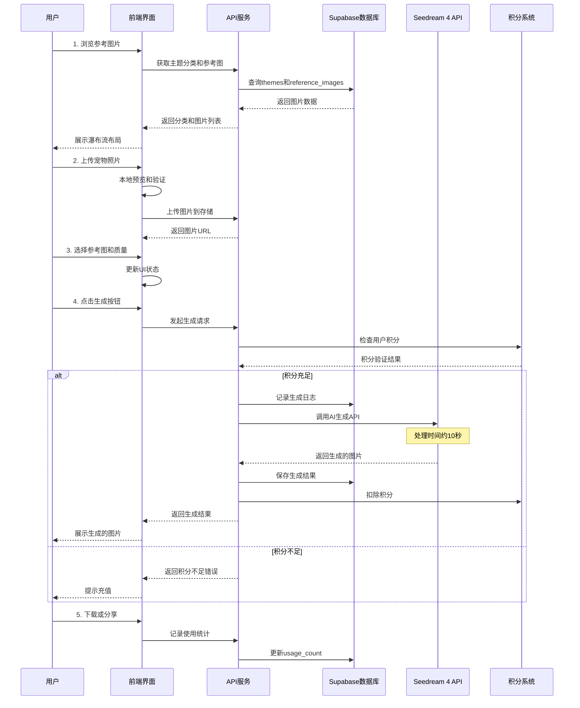

# AI-Petography.com 产品需求文档 (PRD)

## 📋 产品概述

### 核心目标 (Mission)
打造全球领先的AI宠物照片生成平台，让每个宠物主人都能轻松创造出专业级的宠物艺术作品，并通过社区分享传播快乐。

### 用户画像 (Persona)
**主要用户**：宠物主人（25-45岁），热爱分享宠物生活，追求个性化和创意表达
**核心痛点**：
- 想为宠物拍出专业照片但缺乏技能和设备
- 希望创造独特的宠物形象但成本高昂
- 渴望在社交媒体上分享有趣的宠物内容

## 🚀 产品路线图

### V1: 最小可行产品 (MVP)
- ✅ **用户认证系统**（复用现有Supabase认证）
- ✅ **积分付费系统**（复用现有Creem支付）
- ✅ **主题分类浏览**（5个核心主题：节日、职业、奇幻、时尚、艺术）
- ✅ **参考图片展示**（基于使用次数排序的瀑布流布局）
- ✅ **宠物照片上传**（悬浮上传框，支持拖拽）
- ✅ **AI图片生成**（Seedream 4集成，支持普通/2K/4K质量）
- ✅ **生成结果管理**（右侧栏展示，支持下载和重新生成）
- ✅ **基础分享功能**（一键分享到主流社交平台）
- ✅ **用户个人主页**（历史作品展示）

### V2 及以后版本 (Future Releases)
- **用户生成画廊**（独立tab展示所有用户作品）
- 🔄 **多参考图批量生成**
- **内容审核**：用户生成的图片需通过基础AI审核才能发布到公共画廊
- 💬 **社交互动功能**（点赞、评论、收藏）
- 🎨 **创作者模式**（用户上传模板和提示词）
- 🌐 **多语言支持**
- 📱 **移动端APP**

## 📊 关键业务逻辑

### 积分消费规则
- 普通质量：100积分
- 2K质量：300积分
- 4K质量：500积分

### 主题管理
- 管理员可动态添加新主题，每个主题包含多个参考图片
- 主题支持排序和启用/禁用状态

### 使用次数统计
- 每次用户选择参考图生成时，该图片使用次数+1
- 基于使用次数进行热门排序

### 生成限制
- 单次上传最多3张宠物照片
- 单次生成最多选择1个参考图（MVP阶段）

## 🗄️ 数据契约

### 核心数据表结构
```sql
-- 主题分类表
themes (
    id uuid primary key,
    name text not null,
    description text,
    sort_order integer default 0,
    is_active boolean default true,
    created_at timestamp with time zone default now()
);

-- 参考图片模板表  
reference_images (
    id uuid primary key,
    theme_id uuid references themes(id),
    image_url text not null,
    prompt_text text not null,
    usage_count integer default 0,
    is_featured boolean default false,
    created_at timestamp with time zone default now()
);

-- 宠物图片生成记录表
pet_generations (
    id uuid primary key,
    user_id uuid references auth.users(id),
    reference_image_id uuid references reference_images(id),
    pet_image_urls text[] not null,
    generated_image_url text,
    quality_level text check (quality_level in ('normal', '2k', '4k')),
    credits_used integer not null,
    generation_status text default 'pending',
    is_public boolean default false,
    metadata jsonb default '{}',
    created_at timestamp with time zone default now()
);
```

## 🎨 UI/UX 设计方案

### 选定方案：经典瀑布流布局
- **主区域**：瀑布流展示参考图片，支持主题筛选
- **右侧栏**：当前生成结果大图展示 + 历史生成小图滑动浏览
- **底部悬浮**：智能上传区域，支持拖拽上传和质量选择

### 关键交互设计
1. **图片选择**：点击参考图片高亮选中，显示使用次数
2. **上传预览**：支持拖拽上传，实时预览宠物照片
3. **生成进度**：10秒生成过程显示进度条和预计时间
4. **结果展示**：大图展示当前结果，小图滑动浏览历史
5. **一键操作**：下载、重新生成、分享等快捷操作

## 🏗️ 技术架构

### 核心流程图



### 组件交互架构图

```mermaid
flowchart TD
    A[用户界面层] --> B[业务逻辑层]
    B --> C[数据访问层]
    C --> D[外部服务层]

    subgraph "前端组件 (复用现有架构)"
        A1[主页瀑布流组件]
        A2[图片上传组件]
        A3[生成结果组件]
        A4[个人主页组件]
        A5[主题分类组件]
    end

    subgraph "API路由 (新增)"
        B1[/api/pet-images/generate]
        B2[/api/themes]
        B3[/api/reference-images]
        B4[/api/user-generations]
        B5[/api/upload]
    end

    subgraph "数据库表 (新增)"
        C1[themes]
        C2[reference_images]
        C3[pet_generations]
        C4[user_uploads]
    end

    subgraph "现有系统 (复用)"
        C5[customers - 积分系统]
        C6[auth.users - 用户认证]
    end

    subgraph "外部服务"
        D1[Seedream 4 API]
        D2[Supabase Storage]
        D3[Creem 支付系统]
    end

    A1 --> B2
    A1 --> B3
    A2 --> B5
    A3 --> B1
    A4 --> B4

    B1 --> C3
    B1 --> D1
    B2 --> C1
    B3 --> C2
    B4 --> C3
    B5 --> D2

    B1 --> C5
    B4 --> C6
```

### 组件交互说明

#### 新增模块与现有模块的关系

1. **复用现有认证系统**
   - 直接使用 `auth.users` 表和现有的认证中间件
   - 复用 `Header` 组件的用户状态管理

2. **复用现有积分系统**
   - 使用现有的 `customers` 表和积分字段
   - 复用 `use-credits.ts` 和 `use-subscription.ts` hooks
   - 集成现有的 Creem 支付流程

3. **新增核心功能模块**
   - `components/pet-generator/` - 宠物照片生成相关组件
   - `app/pet-generator/` - 新的页面路由
   - `app/api/pet-images/` - 新的API路由

#### 文件结构扩展
```
app/
├── pet-generator/           # 新增：宠物照片生成主页
│   ├── page.tsx
│   └── layout.tsx
├── profile/                 # 扩展：用户个人主页
│   ├── page.tsx            # 修改：添加宠物作品展示
│   └── pet-gallery/        # 新增：个人宠物作品页
├── api/
│   ├── pet-images/         # 新增：宠物图片相关API
│   │   ├── generate/
│   │   ├── upload/
│   │   └── user-gallery/
│   └── themes/             # 新增：主题管理API

components/
├── pet-generator/          # 新增：宠物生成器组件
│   ├── theme-gallery.tsx   # 主题瀑布流
│   ├── upload-zone.tsx     # 上传区域
│   ├── result-panel.tsx    # 结果展示面板
│   └── quality-selector.tsx
└── profile/
    └── pet-works.tsx       # 新增：个人作品展示组件
```

### 技术选型与风险评估

#### 关键技术选型

1. **图片处理**
   - **选择**: 使用 Next.js Image 组件 + Supabase Storage
   - **理由**: 与现有架构一致，支持自动优化和CDN加速

2. **AI图片生成**
   - **选择**: Seedream 4 API
   - **集成方式**: 类似现有的 OpenAI API 调用模式

3. **状态管理**
   - **选择**: React useState + useContext (与现有项目一致)
   - **理由**: 保持技术栈统一，降低复杂度

4. **图片上传**
   - **选择**: 直接上传到 Supabase Storage
   - **优化**: 客户端压缩 + 进度显示

#### 潜在技术风险

1. **AI生成延迟风险**
   - **风险**: 10秒生成时间可能导致用户流失
   - **缓解**: 实现WebSocket实时进度推送，添加有趣的等待动画

2. **图片存储成本**
   - **风险**: 大量高质量图片存储成本高
   - **缓解**: 实现图片压缩策略，设置存储期限

3. **并发生成限制**
   - **风险**: Seedream 4 API可能有并发限制
   - **缓解**: 实现队列系统，显示排队状态

4. **积分系统兼容性**
   - **风险**: 新的积分消费规则可能与现有系统冲突
   - **缓解**: 扩展现有积分系统，保持向后兼容

### 技术栈选择
- **前端**：Next.js 14 + React 19 + TypeScript
- **后端**：Next.js API Routes
- **数据库**：Supabase PostgreSQL
- **认证**：Supabase Auth
- **支付**：Creem.io
- **AI服务**：Seedream 4 API
- **存储**：Supabase Storage
- **样式**：Tailwind CSS + shadcn/ui

### 核心API设计
```typescript
// 生成宠物照片
POST /api/pet-images/generate
{
  referenceImageId: string,
  petImageUrls: string[],
  qualityLevel: 'normal' | '2k' | '4k'
}

// 获取主题列表
GET /api/themes

// 获取参考图片
GET /api/reference-images?themeId=xxx&page=1&limit=20

// 用户生成历史
GET /api/user-generations?userId=xxx&page=1&limit=10
```

## 🎯 成功指标

### MVP阶段关键指标
- **用户注册转化率** > 15%
- **首次生成完成率** > 80%
- **用户留存率**（7天）> 25%
- **平均每用户生成次数** > 3次
- **积分购买转化率** > 10%

### 产品增长指标
- **月活跃用户数** (MAU)
- **用户生成内容数量** (UGC)
- **社交分享次数**
- **平均会话时长**

## 📅 开发计划

### 第一阶段：核心功能开发（4-6周）
1. 数据库设计与迁移
2. 核心API接口开发
3. 前端组件开发
4. Seedream 4 API集成

### 第二阶段：用户体验优化（2-3周）
1. 图片预览和拖拽上传
2. 生成进度显示
3. 结果展示优化
4. 个人主页开发

### 第三阶段：测试与部署（1-2周）
1. 功能测试
2. 性能优化
3. 生产环境部署
4. 用户反馈收集

## 🔒 风险评估

### 技术风险
- **AI生成延迟**：10秒等待时间需要良好的用户体验设计
- **并发限制**：需要实现队列系统处理高并发请求
- **存储成本**：大量图片存储需要成本控制策略

### 业务风险
- **用户获取成本**：需要有效的营销策略
- **内容质量**：AI生成质量直接影响用户满意度
- **竞争压力**：市场上可能出现类似产品

## 🔧 框架修改方案

### 现状分析
当前代码库是一个基于Next.js + Supabase + Creem的中文名字生成器项目，包含完整的用户认证、支付、积分系统等框架功能。为了转换为AI宠物照片生成平台，需要保留框架核心功能，移除业务特定代码。

### 保留的框架基础功能

#### 1. 核心基础设施 ✅ 保留
```
├── app/
│   ├── layout.tsx              # 根布局
│   ├── globals.css             # 全局样式
│   ├── (auth-pages)/           # 认证页面
│   │   ├── sign-in/
│   │   ├── sign-up/
│   │   └── forgot-password/
│   ├── auth/callback/          # OAuth回调
│   ├── dashboard/              # 用户仪表板
│   └── profile/                # 用户个人资料
├── middleware.ts               # 路由保护中间件
├── components/
│   ├── ui/                     # shadcn/ui组件库
│   ├── header.tsx              # 导航头部
│   ├── footer.tsx              # 页脚
│   ├── theme-switcher.tsx      # 主题切换
│   └── mobile-nav.tsx          # 移动端导航
├── hooks/
│   ├── use-user.ts             # 用户状态管理
│   ├── use-credits.ts          # 积分管理
│   ├── use-subscription.ts     # 订阅管理
│   └── use-toast.ts            # 通知提示
├── utils/
│   ├── supabase/               # Supabase客户端配置
│   └── creem/                  # Creem支付工具
├── types/
│   ├── creem.ts                # Creem类型定义
│   └── subscriptions.ts        # 订阅类型定义
```

#### 2. 数据库基础表 ✅ 保留
```sql
-- 用户认证（Supabase内置）
auth.users

-- 客户信息和积分系统
customers (
    id, user_id, creem_customer_id,
    email, name, country, credits,
    created_at, updated_at, metadata
)

-- 订阅管理
subscriptions (
    id, customer_id, status,
    current_period_start, current_period_end,
    creem_product_id, creem_subscription_id
)

-- 积分历史
credits_history (
    id, customer_id, amount, type,
    description, metadata, created_at
)
```

#### 3. API基础功能 ✅ 保留
```
├── app/api/
│   ├── credits/                # 积分管理API
│   ├── webhooks/creem/         # Creem支付回调
│   └── auth/                   # 认证相关API
```

### 需要移除的业务特定功能

#### 1. 中文名字生成器相关 ❌ 删除
```
├── app/
│   ├── page.tsx                # 当前主页（名字生成器）
│   ├── name-detail/            # 名字详情页
│   ├── results/                # 生成结果页
│   ├── product/                # 产品相关页面
│   ├── about/                  # 关于页面
│   ├── privacy/                # 隐私政策
│   └── terms/                  # 服务条款
├── app/api/
│   ├── chinese-names/          # 中文名字生成API
│   ├── saved-names/            # 保存名字API
│   ├── popular-names/          # 热门名字API
│   └── generate-pdf/           # PDF生成API
├── components/
│   ├── product/                # 产品相关组件
│   └── dashboard/              # 仪表板组件（名字相关）
```

#### 2. 中文名字相关数据库表 ❌ 删除
```sql
-- 删除以下迁移文件和相关表
supabase/migrations/20241229000000_chinese_names_tables.sql
supabase/migrations/20241231000000_generation_batches.sql

-- 删除的表：
name_generation_logs
saved_names
popular_names
generation_batches
generated_names
```

#### 3. 业务特定依赖 ❌ 删除
```json
// package.json 中可以移除的依赖
{
  "puppeteer": "^24.15.0",  // PDF生成相关
  "openai": "^5.10.2"       // 如果只用于中文名字生成
}
```

### 修改实施计划

#### 阶段1：清理业务代码（1-2天）
1. **删除页面和组件**
   - 删除 `app/page.tsx`（当前名字生成器主页）
   - 删除 `app/name-detail/`, `app/results/`, `app/product/`
   - 删除 `components/product/` 目录
   - 删除相关的仪表板组件

2. **删除API路由**
   - 删除 `app/api/chinese-names/`
   - 删除 `app/api/saved-names/`
   - 删除 `app/api/popular-names/`
   - 删除 `app/api/generate-pdf/`

3. **清理数据库**
   - 删除中文名字相关的迁移文件
   - 在生产环境中谨慎删除相关表

#### 阶段2：更新框架配置（1天）
1. **更新导航和路由**
   - 修改 `components/header.tsx` 移除名字生成器相关导航
   - 更新 `middleware.ts` 路由保护规则
   - 创建新的主页 `app/page.tsx`

2. **更新环境变量**
   - 移除 `OPENROUTER_API_KEY` 等名字生成相关配置
   - 添加 Seedream 4 API 相关配置

3. **更新文档**
   - 修改 `README.md` 移除中文名字生成器描述
   - 更新项目介绍为AI宠物照片生成平台

#### 阶段3：验证框架完整性（1天）
1. **功能验证**
   - 用户注册/登录流程
   - 积分系统正常工作
   - 支付流程完整
   - 仪表板基础功能

2. **代码清理**
   - 移除未使用的导入和依赖
   - 清理TypeScript类型定义
   - 更新测试用例

### 修改后的框架优势

1. **保持核心价值** - 完整的用户认证、支付、积分系统
2. **降低复杂度** - 移除业务特定代码，专注框架功能
3. **提高复用性** - 清晰的框架边界，便于新功能开发
4. **减少维护成本** - 移除不相关的依赖和代码

### 风险控制

1. **数据备份** - 在删除数据库表前进行完整备份
2. **渐进式删除** - 先注释代码，确认无影响后再删除
3. **功能验证** - 每个阶段完成后进行完整的功能测试
4. **回滚准备** - 保留Git历史，确保可以快速回滚

---

**文档版本**: v1.0
**最后更新**: 2025-01-18
**负责人**: 产品设计团队
